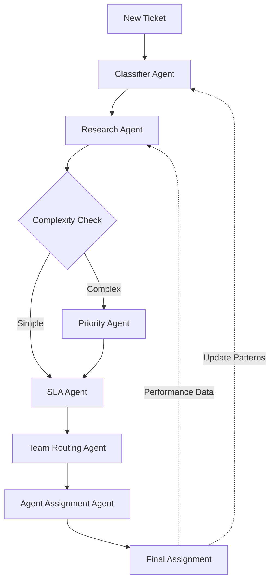
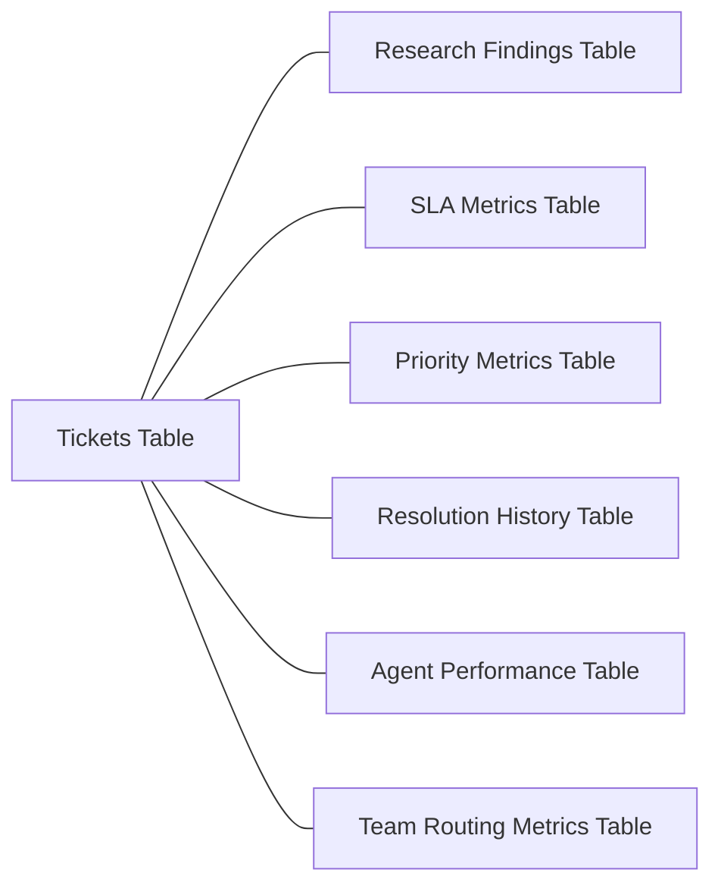

# Project Timeline & Deliverables

## MVP Requirements (Due Tomorrow)

### Authentication

- [x] Basic Supabase Auth
  - [x] Login page
  - [x] Register page
  - [x] Protected routes

### Ticket System

- [x] Basic CRUD
  - [x] Create tickets
  - [x] View ticket list
  - [x] Update ticket status
  - [x] Delete tickets
- [x] Simple assignment system
  - [x] Assign to agent
  - [x] Assign to team

### Team Management

- [x] Basic team structure
  - [x] Create teams
  - [x] Add members
  - [x] Assign roles

## Phase 1 Requirements

### Enhanced Ticket Management

- [x] Advanced filtering
- [x] Search functionality
- [x] Priority levels
- [ ] Custom fields
- [x] File attachments
- [ ] Rich Text editing

### Team Features

- [ ] Team performance metrics
- [ ] Workload distribution
- [ ] Team-based routing
- [ ] Access control levels

### Templates

- [ ] Response templates
- [ ] Template categories
- [ ] Version control
- [ ] Usage tracking

### Knowledge Base

- [ ] Article creation
- [ ] Category organization
- [ ] Search functionality
- [ ] Version control

## Phase 2: Intelligent Ticket Processing System

### Agent System Overview

#### Phase 2.1: Core Analysis Agents

1. **Classifier Agent**

   - **Purpose**: First-line ticket analyzer
   - **Database Interactions**:
     - Reads from: `tickets` (title, description)
     - Writes to: `tickets` (ai_suggested_category, ai_confidence, ai_classification_timestamp)
   - **Functions**:
     - `classifyTicket()`
     - `calculateConfidence()`
     - `provideReasoning()`
   - **Triggers**: New ticket creation, Major ticket updates

2. **Research Agent**
   - **Purpose**: Historical analysis and pattern recognition
   - **Database Interactions**:
     - Reads from:
       - `tickets` (all historical tickets)
       - `ticket_comments` (resolution history)
     - Writes to: `ticket_research_findings` (all fields)
   - **Functions**:
     - `findSimilarTickets()`
     - `analyzePatterns()`
     - `calculateScores()`
   - **Triggers**: After Classifier Agent completes, Manual research request

- [ ] Database Updates
  - [x] Add AI classification columns
  - [x] Add research findings columns
  - [x] Add similar tickets reference columns
- [ ] AI Infrastructure
  - [ ] Set up LangGraph configuration
  - [ ] Implement base agent framework
  - [ ] Create agent coordination system
- [ ] Agent Implementation
  - [ ] Classifier Agent
    - [ ] Category identification
    - [ ] Confidence scoring
    - [ ] Reasoning capture
  - [ ] Research Agent
    - [ ] Similar ticket search
    - [ ] Pattern recognition
    - [ ] Solution suggestion

#### Phase 2.2: Prioritization Agents

3. **Priority Agent**

   - **Purpose**: Determines ticket urgency and business impact
   - **Database Interactions**:
     - Reads from:
       - `tickets` (current and historical)
       - `ticket_research_findings` (impact scores)
     - Writes to:
       - `tickets` (priority)
       - `ticket_priority_metrics` (new table)
   - **Functions**:
     - `assessPriority()`
     - `calculateBusinessImpact()`
     - `predictEscalationRisk()`
   - **Triggers**: After Research Agent completes, Priority review requests

4. **SLA Agent**
   - **Purpose**: Manages response and resolution timeframes
   - **Database Interactions**:
     - Reads from:
       - `tickets` (priority, category)
       - `ticket_sla_metrics` (new table)
     - Writes to:
       - `ticket_sla_metrics` (deadlines, warnings)
   - **Functions**:
     - `calculateDeadlines()`
     - `monitorSLABreachRisk()`
     - `suggestPreemptiveActions()`
   - **Triggers**: After Priority Agent completes, Regular interval checks

- [ ] Database Updates
  - [ ] Add priority prediction columns
  - [ ] Add SLA tracking fields
- [ ] Agent Implementation
  - [ ] Priority assessment
  - [ ] SLA calculation
  - [ ] Workload analysis
  - [ ] Impact evaluation

#### Phase 2.3: Assignment Agents

5. **Team Routing Agent**

   - **Purpose**: Determines best team for ticket handling
   - **Database Interactions**:
     - Reads from:
       - `teams` (team capabilities)
       - `team_members` (team composition)
       - `ticket_research_findings` (complexity scores)
     - Writes to:
       - `tickets` (team_id)
       - `team_routing_metrics` (new table)
   - **Functions**:
     - `analyzeTeamCapabilities()`
     - `matchTicketToTeam()`
     - `balanceTeamWorkload()`
   - **Triggers**: After SLA Agent completes

6. **Agent Assignment Agent**
   - **Purpose**: Selects best individual agent for ticket
   - **Database Interactions**:
     - Reads from:
       - `profiles` (agent skills, workload)
       - `ticket_resolution_history` (new table)
     - Writes to:
       - `tickets` (assigned_to)
       - `agent_performance_metrics` (new table)
   - **Functions**:
     - `evaluateAgentExpertise()`
     - `checkAgentAvailability()`
     - `predictResolutionSuccess()`
   - **Triggers**: After Team Routing Agent completes

- [ ] Database Updates
  - [ ] Add agent expertise tracking
  - [ ] Add workload metrics
  - [ ] Add success rate tracking
- [ ] Agent Implementation
  - [ ] Team matching
  - [ ] Agent matching
  - [ ] Workload balancing
  - [ ] Skill requirement analysis

### Phase 2.4: Integration & Optimization

- [ ] System Integration
  - [ ] Agent coordination
  - [ ] Parallel processing
  - [ ] State management
  - [ ] Error handling
- [ ] Performance Optimization
  - [ ] Response time improvement
  - [ ] Resource usage optimization
  - [ ] Caching implementation
- [ ] UI/UX Implementation
  - [ ] Agent insights display
  - [ ] Recommendation interface
  - [ ] Override controls
  - [ ] Feedback collection

### Agent Interaction Flow

#### Main Flow

#### Database Schema Interactions

### Agent Communication Patterns

1. **Sequential Processing**

   - Classifier → Research → Priority → SLA → Routing → Assignment
   - Each agent waits for previous agent's completion
   - Data passed through database state changes

2. **Feedback Loops**

   - Resolution outcomes feed back to Research Agent
   - Agent performance metrics update routing decisions
   - Pattern recognition improves classification accuracy

3. **Parallel Operations**
   - SLA monitoring runs independently
   - Pattern analysis runs in background
   - Performance metric collection is continuous

### Performance Monitoring

Each agent reports to a central monitoring system:

- Accuracy metrics
- Processing time
- Decision confidence
- Resource usage
- Error rates

### Fallback Mechanisms

Each agent has built-in fallbacks:

- Default classifications if Classifier fails
- Manual routing options if automated routing fails
- SLA defaults for new ticket types
- Backup assignment rules for edge cases

## Technical Debt & Optimization

- [x] Performance optimization
- [x] Code refactoring
- [ ] Test coverage
- [ ] Documentation updates

## Notes

- ✅ = Completed
- 🚧 = In Progress
- ⭐ = Priority Item
- 📝 = Needs Review

## Dependencies

- MVP features required for Phase 1
- Knowledge base required for customer portal
- Template system needed for automation
- API system needed for integrations
